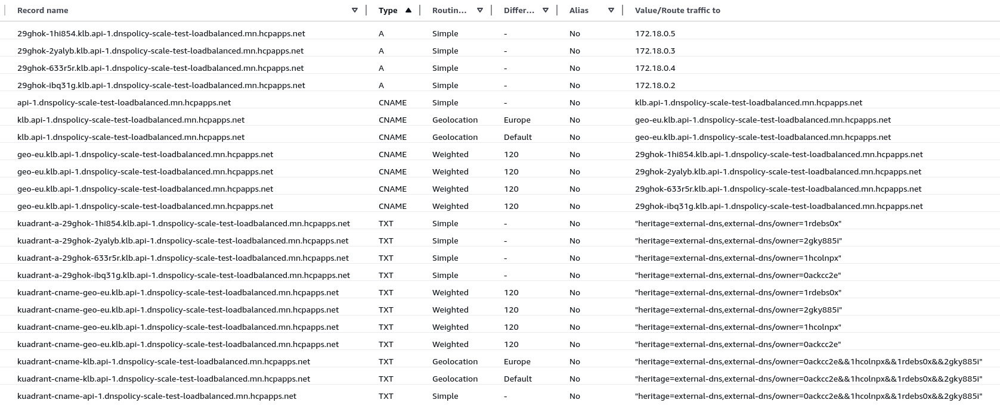

# DNSPolicy Scale Testing

Scale testing using [kube-burner](https://kube-burner.github.io/kube-burner/latest).

## Setup local environment (kind)

Create a kind cluster with kuadrant and prometheus/thanos installed and configured using the [kuadrant-operator](https://github.com/Kuadrant/kuadrant-operator) repo tasks and config.

In the kuadrant-operator directory, run the following to create a local kind cluster with kuadrant deployed:
```shell
make local-setup SUBNET_OFFSET=1 CIDR=26 NUM_IPS=64
```
Note: In order to test at scale, metallb must be configured with enough ip address to assign one to each gateway to be created.  

## Pre-test setup

Scale down the default dns operator:
```shell
kubectl scale deployment/dns-operator-controller-manager --replicas=0 -n kuadrant-system
```
Note: This is required for the default kubeburner workload (namespaced-dns-operator-deployments.yaml) as it creates its own dns operator deployments.

Deploy the observability stack:
```shell
kubectl apply --server-side -k github.com/kuadrant/dns-operator/config/observability?ref=main # Run twice if it fails the first time dut o CRDs i.e. "ensure CRDs are installed first"
```
Note: This should be in the kuadrant-operator repo instead of the dns operator

Forward port for prometheus to allow kube burner to access it on the default PROMETHEUS_URL (http://127.0.0.1:9090):
```shell
kubectl -n monitoring port-forward service/thanos-query 9090:9090
```

## Run test 

The `test-scale-dnspolicy` make target can be used without input to run the default test workload with the default configuration:  

```shell
make test-scale-dnspolicy
```

View created resources:
```shell
kubectl get deployments,gateways,httproutes,secrets,dnspolicy -A -l kube-burner-uuid=3e6516a7-76a7-4e9f-a995-480f3512a8bb
NAMESPACE                 NAME                                 READY   UP-TO-DATE   AVAILABLE   AGE
kuadrant-dns-operator-0   deployment.apps/controller-manager   1/1     1            1           14m
scale-test-0              deployment.apps/gw1-i0-istio         1/1     1            1           13m
scale-test-0              deployment.apps/httpbin              1/1     1            1           14m

NAMESPACE      NAME                                       CLASS   ADDRESS       PROGRAMMED   AGE
scale-test-0   gateway.gateway.networking.k8s.io/gw1-i0   istio   172.18.0.18   True         13m

NAMESPACE      NAME                                                      HOSTNAMES                                                    AGE
scale-test-0   httproute.gateway.networking.k8s.io/httproute-gw1-l1-i0   ["api-1.dnspolicy-scale-test-loadbalanced.kuadrant.local"]   13m

NAMESPACE      NAME                          TYPE                   DATA   AGE
scale-test-0   secret/inmemory-credentials   kuadrant.io/inmemory   1      14m
```
Note: DNSPolices are deleted as part of the run as `SKIP_CLEANUP` defaults to false

Alternatively it can be executed passing in values as required. Please refer to the `test-scale-dnspolicy` make target for possible variables and their default values.
```shell
make test-scale-dnspolicy JOB_ITERATIONS=1 NUM_GWS=1 NUM_LISTENERS=1 SKIP_CLEANUP=true DNS_PROVIDER=aws KUADRANT_ZONE_ROOT_DOMAIN=my.domain.com
```

## Workloads

The following describes the behaviour and configuration of the current DNSPolicy workloads.

### namespaced-dns-operator-deployments

The workload will create multiple instances of the dns operator in separate namespaces(kuadrant-dns-operator-x), and multiple test namespaces (scale-test-x) that the corresponding dns operator is configured to watch. 
The number of dns operator instances and test namespaces created is determined by the `JOB_ITERATIONS` environment variable. 
In each test namespace a test app and service is deployed and one or more gateways are created determined by the `NUM_GWS` environment variable. 
The number of listeners added to the gateway is determined by the `NUM_LISTENERS` environment variable. 
Each listener hostname is generated using the listener number and the `KUADRANT_ZONE_ROOT_DOMAIN` environment variable.
In each test namespace a dns provider credential is created, the type created is determined by the `DNS_PROVIDER` environment variable, additional environment variables may need to be set depending on the provider type.

#### Example Run

Create a shared recordset in AWS (DNS_PROVIDER=aws) for a single host with four distinct A record values, owned by four DNSRecord resources, created by four gateway/dnspolices (JOB_ITERATIONS * NUM_GWS) processed by two dns operators(JOB_ITERATIONS). 

```shell
make test-scale-dnspolicy JOB_ITERATIONS=2 NUM_GWS=2 NUM_LISTENERS=1 DNS_PROVIDER=aws KUADRANT_AWS_ACCESS_KEY_ID=<my aws access key> KUADRANT_AWS_SECRET_ACCESS_KEY=<my aws secret id>. KUADRANT_AWS_REGION='' KUADRANT_ZONE_ROOT_DOMAIN=mn.hcpapps.net SKIP_CLEANUP=true
...
time="2025-01-13 10:19:27" level=info msg="Finished execution with UUID: 469d4b4e-6c41-4433-8c4b-2c48ea4973bc" file="job.go:247"
time="2025-01-13 10:19:27" level=info msg="👋 Exiting kube-burner 469d4b4e-6c41-4433-8c4b-2c48ea4973bc" file="kube-burner.go:85"
```

Resource Created in cluster:

```shell
kubectl get deployments,gateways,httproutes,secrets,dnspolicy -A -l kube-burner-uuid=469d4b4e-6c41-4433-8c4b-2c48ea4973bc
NAMESPACE                 NAME                                 READY   UP-TO-DATE   AVAILABLE   AGE
kuadrant-dns-operator-0   deployment.apps/controller-manager   1/1     1            1           12m
kuadrant-dns-operator-1   deployment.apps/controller-manager   1/1     1            1           12m
scale-test-0              deployment.apps/gw1-i0-istio         1/1     1            1           9m26s
scale-test-0              deployment.apps/gw2-i0-istio         1/1     1            1           9m26s
scale-test-0              deployment.apps/httpbin              1/1     1            1           11m
scale-test-1              deployment.apps/gw1-i1-istio         1/1     1            1           9m26s
scale-test-1              deployment.apps/gw2-i1-istio         1/1     1            1           9m25s
scale-test-1              deployment.apps/httpbin              1/1     1            1           11m

NAMESPACE      NAME                                       CLASS   ADDRESS      PROGRAMMED   AGE
scale-test-0   gateway.gateway.networking.k8s.io/gw1-i0   istio   172.18.0.2   True         9m26s
scale-test-0   gateway.gateway.networking.k8s.io/gw2-i0   istio   172.18.0.3   True         9m26s
scale-test-1   gateway.gateway.networking.k8s.io/gw1-i1   istio   172.18.0.4   True         9m26s
scale-test-1   gateway.gateway.networking.k8s.io/gw2-i1   istio   172.18.0.5   True         9m25s

NAMESPACE      NAME                                                      HOSTNAMES                                                    AGE
scale-test-0   httproute.gateway.networking.k8s.io/httproute-gw1-l1-i0   ["api-1.dnspolicy-scale-test-loadbalanced.mn.hcpapps.net"]   9m26s
scale-test-0   httproute.gateway.networking.k8s.io/httproute-gw2-l1-i0   ["api-1.dnspolicy-scale-test-loadbalanced.mn.hcpapps.net"]   9m26s
scale-test-1   httproute.gateway.networking.k8s.io/httproute-gw1-l1-i1   ["api-1.dnspolicy-scale-test-loadbalanced.mn.hcpapps.net"]   9m25s
scale-test-1   httproute.gateway.networking.k8s.io/httproute-gw2-l1-i1   ["api-1.dnspolicy-scale-test-loadbalanced.mn.hcpapps.net"]   9m25s

NAMESPACE      NAME                     TYPE              DATA   AGE
scale-test-0   secret/aws-credentials   kuadrant.io/aws   3      11m
scale-test-1   secret/aws-credentials   kuadrant.io/aws   3      11m

NAMESPACE      NAME                                     AGE
scale-test-0   dnspolicy.kuadrant.io/dnspolicy-gw1-i0   9m26s
scale-test-0   dnspolicy.kuadrant.io/dnspolicy-gw2-i0   9m26s
scale-test-1   dnspolicy.kuadrant.io/dnspolicy-gw1-i1   9m25s
scale-test-1   dnspolicy.kuadrant.io/dnspolicy-gw2-i1   9m25s
```

Records Created in AWS:



## Useful commands

Delete all resources created by the test, useful if you used SKIP_CLEANUP=true
```shell
kubectl delete gateway,httproute,dnspolicy,all -A -l app=scale-test
```

Tail all logs of dns operators created by a specific kubeburner job
```shell
kubectl stern -l kube-burner-job=dnspolicy-scale-test-setup-namespaced-dns-operators -A
```
